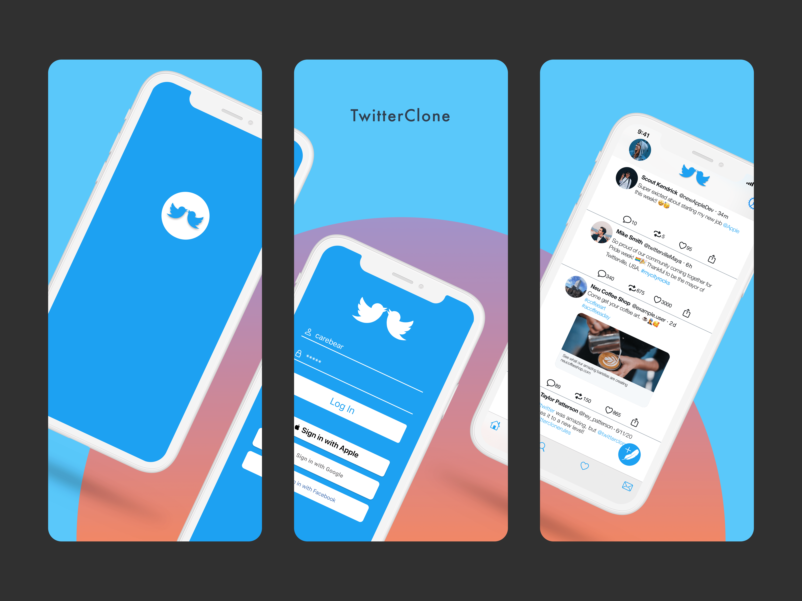

# TwitterClone

## Author

Taylor Patterson

## Description

What better way to test out your skills as a developer than to try and tackle one of the most iconic social media apps. As the app name states, TwitterClone is a replica of Twitter. I wanted to replicate Twitter to practice MVVM structural design, dive further with OOP, programmatically build every UIView, practice building a cloud database through Firebase, as well as direct messaging functionality through Firebase as well.

## Tools Used

**Firebase** - Google's answer to storing mobile data.

**How I Used Twitter's API** - What can't be said already about Firebase that hasn't been stated yet? It's fast, easy to learn, and can be implemented with Apple's sign in functionality.  I used Firebase's Cloud Firestore and Authentication capabilities to register new users, send and receive tweets and direct messages, as well as the link functionality.  I chose Firebase because of its ease of use and how fast the cloud database is.   

For more info on **Firebase** click [here](https://firebase.google.com/)

**MVVM** - A better approach to iOS Design Pattern. 

**How I used MVVM** - When I first started out learning iOS development, I learned all I could about MVC (the design pattern used by Apple). However, after research, discussions with another (paid) iOS developer, and just the shear realization how massive code can become in MVC or Massive View Conroller, I started to look for a better design approach to my coding architecture then came MVVM.  I've wanted to use MVVM for a while now, but most of my projects have been small and MVC being fine for what I was doing. I chose to use MVVM for TwitterClone due to the size of the app and moving parts, and this way I could neatly keep each functionality separate thus resulting in cleaner and more readable code.  This wasn't an easy task, and it took me a bit to get use to the design pattern, but I really like the way MVVM has made me think more about how my code looks as well as the functionality of it.  Plus, it really makes you practice your OOP and POP programming fundamentals. 

For more info on **MVVM** click [here](https://www.raywenderlich.com/34-design-patterns-by-tutorials-mvvm)

**Sketch** - A dataset based on Sanders' tweet sentiment dataset.  

**How I used Sketch** - What I love about iOS development is you have fill the roll of a full stack developer. In one moment you're networking with APIs and creating backend functionality through CoreData or Firebase all the while keeping in mind to make the app look pretty with UI/UX elements for the user. For the "pretty" aspect, I wanted to learn a tool that was built for UI/UX design, used in the industry, and did not have a steep learning curve.  Sketch has fit every need thus far.  Every mockup picture on my portfolio was built with swift as well as many of the buttons, backgrounds, and screens used in my applications. Sketch is an invaluable tool that has made me look at iOS design with a much different eye.

For more info on **Sketch** click [here](https://www.sketch.com/)